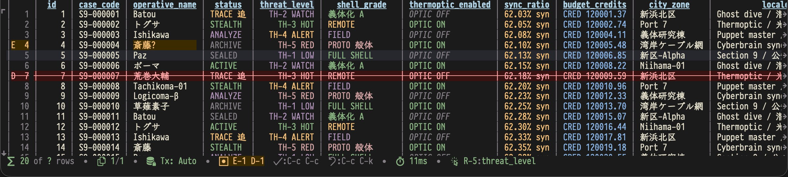
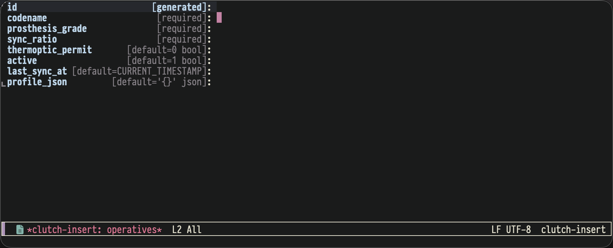
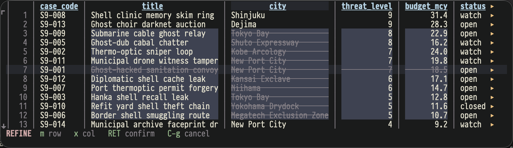
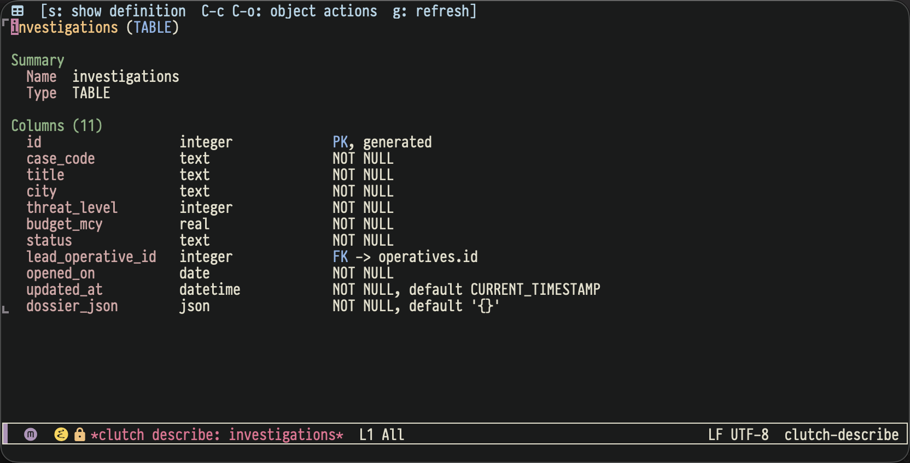

#+TITLE: clutch Interactive Client Guide

* SQL Editing (clutch-mode) Key Bindings

| Key         | Action                     |
|-------------+----------------------------|
| =C-c C-c=   | Execute region, or the current =;=-delimited statement / query at point |
| =C-c C-r=   | Execute selected region; multiple =;=-delimited statements run sequentially |
| =C-c C-b=   | Execute entire buffer; multiple =;=-delimited statements run sequentially |
| =C-c C-e=   | Connect; query consoles reconnect their own saved connection |
| =C-c C-j=   | Jump to configured primary object types and run the default action |
| =C-c C-d=   | Describe object at point, or prompt |
| =C-c C-o=   | Show object actions for the current object, or prompt |
| =C-c C-p=   | Preview execution (dry-run) |
| =C-c C-l=   | Switch current schema/database on the active connection |
| =C-c C-s=   | Refresh schema for current connection now |
| =C-c C-m=   | Commit transaction (manual-commit connections only) |
| =C-c C-u=   | Roll back transaction (manual-commit connections only) |
| =C-c C-a=   | Toggle auto-commit on/off for the current connection |
| =C-c ?=     | Transient menu             |

Standard editing integrations still apply in =clutch-mode=: xref lookup uses
=M-.= through the buffer-local xref backend, and completion stays on normal
CAPF keys such as =TAB= / =M-TAB= inherited from Emacs.

* Result Browser (clutch-result-mode) Key Bindings

| Key            | Action                                        |
|----------------+-----------------------------------------------|
| =RET=          | Open record view                              |
| =TAB= / =S-TAB= | Next cell / previous cell                   |
| =n= / =p=     | Next row / previous row (same column)         |
| =M-n= / =M-p= | Alias for next row / previous row             |
| =N= / =P=     | Next page / previous page (SQL pagination)    |
| =M->= / =M-<= | Last page / first page                       |
| =#=            | Query total row count                         |
| =A=            | Aggregate numeric values (region/current cell; =C-u= with region enters visual refine mode) |
| =]=            | Page right (snap to next column border)       |
| =[=            | Page left (snap to previous column border)    |
| ===            | Widen current column                          |
| =-=            | Narrow current column                         |
| =W=            | WHERE filter (press again to clear)           |
| =/=            | Client-side fuzzy filter (empty to clear)     |
| =s=            | Sort by column (toggles ASC/DESC on repeat)   |
| =S=            | Sort descending                               |
| =C=            | Jump to column                                |
| =?=            | Show column type info at point                |
| =g=            | Re-execute query                              |
| =C-c '=       | Edit / re-edit at point                       |
| =i=            | Stage new row for insertion                   |
| =I=            | Clone current row into a prefilled insert form (without PK values) |
| =d=            | Stage row(s) for deletion (supports region)   |
| =C-c C-c=     | Commit all pending changes (INSERT/UPDATE/DELETE) |
| =C-c C-k=     | Discard pending change at point               |
| =C-c C-p=      | Preview execution (pending batch if any; otherwise effective query) |
| =c=            | Open copy transient menu (choose TSV / CSV / INSERT / UPDATE; toggle =-r= to refine) |
| =v=            | View cell value (JSON / XML / BLOB preview — auto-detected) |
| =V=            | Open live value viewer (follows point; =f= freeze, =g= refresh, =q= quit) |
| =|=            | Pipe the current cell through a shell command |
| =e=            | Export all rows (CSV / INSERT / UPDATE copy/file) |
| =f=            | Toggle fullscreen                             |
| =C-c ?=        | Transient menu                                |

Tip: =c= supports both regular region and rectangular selection (=C-x SPC=).
Tip: use =A= after =C-x SPC= to aggregate selected numeric cells quickly.
Tip: =v= keeps a static snapshot of the current cell; =V= opens =*clutch-live-view*=,
which follows point until you press =f= to freeze it or =q= to close it.
Tip: the result-buffer status line uses compact staged-change tokens:
=E-<n>= for pending edits, =D-<n>= for pending deletions, and =I-<n>= for pending inserts.
When a query result is not updateable because no primary key was detected,
the same line shows =PK missing= and =E/D off=; =C-c '= also errors
immediately instead of opening an edit buffer that cannot be committed.
Tip: SQL-backed result refreshes (=g=, =W=, sort, paging) keep the column
header visible; busy state temporarily replaces the elapsed-time segment in the
footer with a spinner instead of replacing the table header with the query-console
connection header.
Tip: pending changes can be previewed with =C-c C-p= and copied/saved from the
result transient as the exact staged SQL batch.
Tip: INSERT copy/export from joined, derived, or otherwise ambiguous result
queries uses =MY_TABLE= as a placeholder target instead of guessing a wrong
real table name.

#+CAPTION: Result browser with staged markers, sort state, and query timing.

** Per-column displayers

Result buffers can replace the visible text for a specific table/column pair
without changing the raw cell value.  The displayer receives the raw Elisp
value stored in =clutch-full-value= and may return a propertized string.  A
=nil= return falls back to the default renderer.  Truncation, padding, cell
faces, and the value viewers (=v= / =V=) still use the normal clutch pipeline.

#+begin_src emacs-lisp
;; Simple registration API
(clutch-register-column-displayer
 "tasks" "status"
 (lambda (value)
   (pcase value
     (0 (propertize "pending" 'face 'warning))
     (1 (propertize "active" 'face 'success))
     (2 (propertize "done" 'face 'shadow)))))

;; Or customize the full registry directly
(setq clutch-column-displayers
      '(("bookmarks" . (("url" . my-bookmark-url-displayer)))))
#+end_src

Table and column names are matched case-insensitively.  Use
=clutch-unregister-column-displayer= to remove one registration.

** Insert Buffer Keys

The insert buffer is intentionally form-like: =TAB= moves between fields,
while completion stays on Emacs' completion keys.

| Key                  | Action                                          |
|----------------------+-------------------------------------------------|
| =RET=                | Accept current field and move to next field     |
| =TAB= / =S-TAB=      | Next field / previous field                     |
| =M-TAB= / =C-M-i=    | Complete current field value (prefers CAPF; falls back to chooser) |
| =C-c '=              | Edit current JSON field in a dedicated buffer   |
| =C-c .=              | Set current date/time field to "now"            |
| =C-c C-a=            | Toggle sparse vs all-column layout              |
| =C-c C-y=            | Import TSV / CSV from region or kill ring       |
| =C-c C-c=            | Stage new row / update staged insert            |
| =C-c C-k=            | Cancel                                          |

Insert buffers open in a *sparse* layout by default: required/no-default fields
show first, and prefilled values stay visible.  =C-c C-a= expands back to *all
columns*, including generated/defaulted ones, without losing anything you've
already typed.  Field labels are read-only, aligned to a shared value column,
and may show tags such as =generated=, =default=..., =enum=, =bool=, =json=,
and =required=.  The active field line is highlighted.  Insert buffers also
validate locally as you type: obvious enum / bool / json / numeric / date-time
mistakes are shown inline on the current field before staging.

=C-c C-y= imports delimited text directly into the form.  A single imported row
prefills the current insert buffer; multiple rows are staged immediately as
pending inserts.  Header-based imports map by column name; otherwise clutch maps
positionally using the fields currently visible in the insert form.

JSON fields still support direct editing in the insert buffer, but =C-c '= opens
an on-demand child editor for more comfortable multi-line editing.  Saving that
child editor writes compact JSON back into the insert form, so the primary flow
remains result buffer -> insert buffer.

#+CAPTION: Insert buffer with aligned labels, inline metadata tags, and the value column focused.

** Visual Refine Mode (=c -r= / =C-u A=)

The copy transient (=c=) offers a =-r= switch for *refine mode*.  With an
active region, enabling =-r= before choosing a format lets you interactively
exclude rows or columns before the copy is performed.  The mode-line at the
bottom of the result buffer is replaced with a color-coded hint for the
duration of the session.

The region can be set with =C-x SPC= (rectangle mark), a normal mark
(=C-SPC=), or mouse selection — all three are accepted.  Regardless of
how the region was set, clutch resolves the start and end cells and
expands the selection into a full rectangle covering all rows and
columns in that range.

Typical flow:

1. Select a region, then press =c= to open the copy transient.
2. Toggle =-r= and choose the target format (=t= / =c= / =i=).
3. In refine mode, use =m= to exclude rows and =x= to exclude columns.
4. Press =RET= to confirm and copy only the remaining rectangle.

#+CAPTION: Refine mode for excluding rows and columns before copy.

| Key   | Action                              |
|-------+-------------------------------------|
| =m=   | Toggle exclusion of row at point    |
| =x=   | Toggle exclusion of column at point |
| =RET= | Confirm — execute copy / aggregate  |
| =C-g= | Cancel — discard all exclusions     |

* Record View (clutch-record-mode) Key Bindings

| Key         | Action                        |
|-------------+-------------------------------|
| =RET=       | Expand long field / follow FK |
| =n= / =p=  | Next row / previous row       |
| =I=         | Clone current record into a prefilled insert form (without PK values) |
| =v=         | View field value (JSON / XML / BLOB preview) |
| =V=         | Open live value viewer (follows point; =f= freeze, =g= refresh, =q= quit) |
| =g=         | Refresh                       |
| =q=         | Quit                          |
| =C-c ?=     | Transient menu                |

* Describe View (clutch-describe-mode) Key Bindings

| Key         | Action                        |
|-------------+-------------------------------|
| =s=         | Show DDL / source             |
| =g=         | Refresh describe buffer       |
| =C-c C-d=   | Describe object at point, or prompt |
| =C-c C-o=   | Show object actions           |

* Typical Workflows

** Query + Pagination + Filter + Sort

#+begin_src
1. Write SQL:  SELECT * FROM orders;
2. C-c C-c    Execute → results displayed with pagination (default 500 rows/page)
              → mode-line shows: Σ 500 of ? rows • 1 / 1 • ⏱ 42ms
3. N / P      Next page / previous page
4. #          Query total rows → mode-line shows "Σ 500 of 1234 rows"
5. ] / [      Page horizontally with column-aligned snapping
              → all columns stay searchable because they remain in the buffer
6. W          Pick column (defaults to column at point), enter value or condition
              e.g., select "status" then type: pending   → WHERE status = 'pending'
              e.g., select "amount" then type: > 100     → WHERE amount > 100
              → Appends WHERE clause, re-queries from page 1
7. /          Client-side filter: type a pattern to narrow visible rows instantly
8. s          Sort by current column (SQL ORDER BY), re-queries from page 1
              → mode-line adds current ORDER BY state
9. A          Aggregate selected cells/current cell
              → mode-line adds aggregate status (sum/avg/min/max + [rows/cells/skipped])
10. W         Enter empty string → clears filter, restores original query
#+end_src

** Foreign Key Navigation

#+begin_src
1. SELECT * FROM orders;     → C-c C-c to execute
2. Move cursor to a value in the user_id column (FK columns are underlined)
3. RET → opens record view
4. Press RET on an FK field → automatically runs SELECT * FROM users WHERE id = <value>
#+end_src

** Editing Data

#+begin_src
1. SELECT * FROM users;      → C-c C-c to execute
2. Move cursor to the cell to modify
3. C-c '                      → opens edit buffer; JSON columns jump straight into the JSON sub-editor
4. Header shows edit-relevant tags like [enum], [json], or [datetime]
                               M-TAB completes enum / bool-like values when available
                               non-JSON edit buffers still use C-c ' for the JSON sub-editor fallback
                               C-c . sets temporal columns to now
5. Edit the value, C-c C-c to stage (C-c C-k to cancel)
                               enum / bool / numeric / temporal fields validate locally as you edit
                               JSON validation follows the same model but waits for a short idle pause
                               validation shows a compact inline token instead of a long full-line message
                               C-c C-c reuses the same validation rules before staging
                               mode-line shows staged edit/delete/insert summary
6. Repeat for other cells — modified cells are highlighted
7. C-c C-c in result buffer  → confirmation prompt showing the UPDATE statements
#+end_src

** Insert / Delete Rows

#+begin_src
1. SELECT * FROM users;      → C-c C-c to execute
2. i                          → opens a sparse insert buffer for the result table
3. I                          → clones the current row into a prefilled insert buffer without PK values
4. RET / TAB / S-TAB          → move quickly between fields
                               field labels are read-only, aligned, and can show tags like [enum], [json], [default=...]
5. C-c C-a                    → expand back to all columns when needed
6. C-c C-y                    → import TSV / CSV into the form; multi-row import stages rows directly
7. M-TAB / C-M-i              → complete enum / bool-like fields (falls back to a chooser if needed)
8. C-c ' on a JSON field      → open a dedicated JSON editor when the value gets large
9. C-c .                      → set current date/time field to "now"
10. Inline validation          → field-level mistakes show up immediately while editing
                               JSON validation waits for a short idle pause
                               validation uses compact inline tokens so long errors do not deform the form layout
11. C-c C-c                    → validate locally, then stage (C-c C-k cancels)
                               staged rows appear as ghost rows in result buffer
                               left marker shows =I= and status line shows =I-<n>=
                               missing generated/defaulted columns render as <generated> / <default>
12. C-c ' on a pending insert row → re-open that staged insert with its previous values
13. Use normal Emacs region selection to select rows
14. d                          → stage current row or selected region for deletion
                               left marker shows =D= and status line shows =D-<n>=
                               deleted rows are visually marked in the result buffer
15. C-c C-k                   → discard pending change at point
16. g with pending changes    → prompts "Discard pending changes and re-run query?"
17. C-c C-c in result buffer → confirmation prompt showing all statements
                               commits in order: INSERT → UPDATE → DELETE
                               edited rows show =E= in the left marker column and =E-<n>= in the status line
#+end_src

The confirmation preview always shows fully rendered SQL text.  Native MySQL,
PostgreSQL, and SQLite backends still execute staged DML through parameterized
prepared/bound values under the hood; JDBC keeps the current literal-SQL
fallback until the sidecar grows a dedicated prepared-execute op.

* REPL Mode

#+begin_src
M-x clutch-repl          ;; Open REPL buffer (*clutch REPL*)
C-c C-e                     ;; Connect to database
db> SELECT * FROM users;     ;; Type SQL, auto-executes on ;
                             ;; Multi-line input supported (continuation prompt     ->)
#+end_src

| Key         | Action                        |
|-------------+-------------------------------|
| =C-c C-e=   | Connect                       |
| =C-c C-m=   | Commit transaction            |
| =C-c C-u=   | Roll back transaction         |
| =C-c C-a=   | Toggle auto-commit            |
| =C-c C-j=   | Jump to object                |
| =C-c C-d=   | Describe object               |
| =C-c C-o=   | Object actions                |
| =C-c C-l=   | Switch current schema/database |

Useful =M-x= entry points outside the main keymaps:

- =clutch-switch-database= — ClickHouse-only reconnect-based database switch
- =clutch-describe-refresh= — refresh the current describe buffer
- =clutch-object-show-ddl-or-source= — show object DDL/source directly
- =clutch-browse-table= — insert =SELECT *= for a table-like object into a live console
- =clutch-describe-table= / =clutch-describe-table-at-point= — describe a table explicitly
- =clutch-result-copy-pending-sql= / =clutch-result-save-pending-sql= — export the exact staged DML batch

* Query Console

=clutch-query-console= opens a dedicated buffer =*clutch: NAME*= for a saved
connection, enables =clutch-mode=, and connects automatically.  Repeated calls
with the same name switch to the existing buffer rather than creating a new one.
Connection happens before the buffer is shown: if the initial connect or a
reconnect of an existing disconnected console fails, clutch raises the error
without leaving a visible disconnected console buffer behind.

Inside a query console, =C-c C-e= reconnects only that console's saved
connection.  It does not reopen the full connection list.  If that saved
connection entry was removed from =clutch-connection-alist=, clutch raises a
clear error instead of silently reconnecting to some other database.  To move
to a different saved connection, call =clutch-query-console= again.

=clutch-switch-console= lists all open console buffers via =completing-read= for
fast switching between active connections.

** Paste whitespace cleanup

Text pasted into a query console is automatically cleaned: trailing
whitespace, mixed tabs/spaces, and CRLF line endings are fixed in the
pasted region only — existing SQL in the buffer is not touched.
Disable with =(setq clutch-console-yank-cleanup nil)=.

** Console persistence

Buffer content is automatically saved to =clutch-console-directory=
(default: =~/.emacs.d/clutch/=) and restored the next time the same
console is opened.  Each connection gets its own file (e.g. =dev-mysql.sql=).
Content is saved when the buffer is killed or when Emacs exits.

Suggested global bindings:

#+begin_src emacs-lisp
(global-set-key (kbd "C-c d") #'clutch-query-console)
(global-set-key (kbd "C-c D") #'clutch-switch-console)
#+end_src

* Object Workflow

#+begin_src
C-c C-j                     ;; Main object entrypoint
C-c C-d                     ;; Describe object at point, or prompt
C-c C-o                     ;; Show object actions for the current object, or prompt
#+end_src

The main navigation path is object-centric rather than tree-centric.  =C-c C-j=
is the single conceptual object entrypoint.  It resolves an object at point
when possible; otherwise it opens a flat annotated object picker.  By default
the primary set is =TABLE= / =VIEW= / =SYNONYM=, configurable via
=clutch-primary-object-types=.  The picker
returns quickly with schema snapshot objects and any already-warmed metadata,
then keeps warming slower categories such as indexes, sequences, and routines
in the background after schema refreshes.  Once an object is resolved, =RET=
runs the object's default action.  In query consoles and the REPL, when point
is already on a table-like object, =C-c C-j= opens the picker prefilled with
that name instead of inserting browse SQL immediately; =RET= stays the explicit
browse trigger.

=C-c C-d= is a describe-focused wrapper over the same resolution logic.  It resolves
the object at point when possible; otherwise it prompts with the same flat
picker.  It opens the shared describe buffer for the target object.  That
buffer is only a view over the same object model; it does not define a second
action universe.

=C-c C-o= is the direct “show me actions” wrapper over the same object model.
It resolves the object at point when possible; otherwise it prompts, then opens
the shared action UI.  The action set is
intentionally small and shared across Embark and Transient:

#+CAPTION: Object describe buffer with action hints and column metadata.

- =d=: describe object
- =s=: show DDL / source
- =j=: jump to the target object for objects with explicit target metadata
  such as indexes, triggers, and synonyms
- =n=: copy object name
- =f=: copy fully-qualified object name

=C-c C-l= switches the current schema/database on the active connection and
refreshes metadata for the new context.  Oracle/JDBC connections can switch
business schemas such as =zj_test= and =cjh_test= within one connection,
PostgreSQL-style wire connections use =SET search_path TO ...=, and MySQL
connections map schema switching to =USE database=.  ClickHouse is handled
separately: it has databases rather than runtime schemas, so =C-c C-l=
prompts with =SHOW DATABASES= and reconnects to the selected =:database=
instead of attempting session-level schema switching.  Generic
=:backend jdbc= connections only support runtime schema switching when clutch
has an explicit implementation for that driver/backend; custom JDBC URLs such
as KingbaseES do not gain schema switching automatically.

For JDBC backends, clutch-jdbc-agent now isolates foreground SQL from metadata
traffic by keeping separate primary and metadata JDBC sessions under one
logical clutch connection.  This avoids Oracle-style contention between user
queries and background schema/object introspection.

Default actions only depend on the object type:

- tables / views / synonyms: insert =SELECT *= into a query console
- procedures / functions / triggers: show source
- indexes / sequences: show DDL

For JDBC/Oracle connections, =C-c C-j= shows annotated object candidates in the
minibuffer.  The object name remains the primary candidate text; source/type is
shown as a gray annotation on the right (for example =PUBLIC/synonym= or
=APP/synonym=).  When duplicate names need disambiguation, the target owner is
appended as extra detail.

If you use [[https://github.com/oantolin/orderless][orderless]], annotation search works naturally here:
=&public=, =&synonym=, =&view=, etc.

* Embark Integration (optional)

If [[https://github.com/oantolin/embark][embark]] is installed, clutch registers a =clutch-object= target type so objects
can be acted on with the same shared action set used by the native =transient=
fallback:

| Key | Action |
|-----+--------|
| =d= | Describe object |
| =j= | Jump to target object (only for target-capable objects such as synonyms, indexes, and triggers) |
| =n= | Copy object name |
| =f= | Copy fully-qualified object name |

Objects are recognised as targets in four contexts:

- *=clutch-mode= (SQL buffer)* — symbol at point, resolved against known objects
- *=clutch-repl-mode=* — symbol at point
- *=completing-read= minibuffer* — current candidate in =C-c C-j= / =C-c C-d= / =C-c C-o=
- *describe / definition buffers* — the object currently shown in that buffer

Without Embark, =C-c C-o= opens a =transient= menu with the same object-driven
actions from the current SQL, REPL, minibuffer, describe buffer, or definition
buffer context.  Object-specific actions are marked unavailable in the
transient when the current object type cannot support them.

Embark only exposes secondary object actions.  Default actions such as
=C-c C-j= itself and table-like row browsing stay on =RET= rather than being
duplicated in the Embark menu.  Actions that depend on object capabilities, such
as =jump target=, only appear for objects that actually carry explicit target
metadata.

* Transient Menus

Requires the =transient= package (built-in since Emacs 28.1).

Press =C-c ?= to open the transient menu.  The *Objects* group contains =Jump to object=, =Describe object=, =Object actions=, and =Refresh schema=.

The *Connection* group contains =Connect=, =Prepare SSH= (=S=), =Disconnect=,
=Commit=, =Rollback=, =Auto-commit=, and =REPL=.  =Prepare SSH= opens an
interactive OpenSSH setup session for host-key confirmation or key passphrase
entry before retrying the normal non-interactive connect path.

In the result buffer, the *Edit* group in the transient menu provides the unified staged-commit workflow: =i= stages an insert, =d= stages a deletion, =C-c C-k= discards a pending change at point, and =C-c C-c= commits all pending changes (INSERT → UPDATE → DELETE) in a single confirmation.

The result and record transients also expose an *Inspect* group: =v= opens the
static cell viewer, while =V= opens the live viewer that follows point.  Once
the live viewer is open, use =f= to freeze/unfreeze it, =g= to force a refresh,
and =q= to close it.

* Faces

Customize these through =M-x customize-group RET clutch RET=:

| Face | Purpose |
|------+---------|
| =clutch-header-face= / =clutch-header-active-face= | Result-table headers and the active header cell |
| =clutch-border-face= | Table borders and separators |
| =clutch-null-face= | NULL cell values |
| =clutch-modified-face= / =clutch-pending-delete-face= / =clutch-pending-insert-face= | Staged edit/delete/insert markers in result buffers |
| =clutch-fk-face= | Foreign-key cell values |
| =clutch-executed-sql-marker-face= | Last executed SQL marker in SQL buffers |
| =clutch-error-position-face= / =clutch-error-banner-face= | SQL execution error highlights |
| =clutch-object-type-face= | Object type labels in describe/object UIs |
| =clutch-object-source-face= / =clutch-object-public-source-face= | Object source/schema annotations |
| =clutch-insert-field-name-face= / =clutch-insert-field-tag-face= | Insert-form labels and metadata tags |
| =clutch-insert-field-error-face= / =clutch-insert-inline-error-face= | Insert/edit validation feedback |
| =clutch-insert-active-field-face= / =clutch-insert-active-field-name-face= | Active field highlighting in insert buffers |

* Query Timeout and Interrupt

- =clutch-connect-timeout-seconds= controls connect timeout (default: 10s).
- =clutch-read-idle-timeout-seconds= controls query I/O idle timeout (default: 30s).
- =clutch-query-timeout-seconds= controls database-side statement timeout for JDBC and native PostgreSQL queries (default: 30s).
- =clutch-jdbc-rpc-timeout-seconds= controls Emacs <-> JDBC agent RPC timeout (default: 30s).
- MySQL connections can override via =:connect-timeout= and =:read-idle-timeout=.
- PostgreSQL connections can override via =:connect-timeout=, =:read-idle-timeout=, and =:query-timeout=.
- JDBC connections can override via =:connect-timeout=, =:read-idle-timeout=, =:query-timeout=, and =:rpc-timeout=.
- During long-running queries, press =C-g= to interrupt.
  - On JDBC backends, clutch first sends a protocol-level =cancel= for the
    running statement.
  - On native PostgreSQL, clutch sends a protocol-level =CancelRequest=, drains
    the main socket back to =ReadyForQuery=, and keeps the same session usable.
  - When that backend-specific cancel succeeds, the connection stays usable and
    you can run the next SQL immediately on the same session.
  - clutch only drops the connection when interrupt recovery fails, for example
    if cancel times out, the agent has exited, or the JDBC session is already
    dead.
  - Backends without explicit interrupt support still fall back to
    disconnect/reconnect semantics.
- =M-x clutch-debug-mode= is the opt-in deep-debug workflow and is off by
  default.  When enabled, clutch records a bounded redacted trace of recent
  connect/query/interrupt/object/metadata events in =*clutch-debug*=, and JDBC
  also requests an additional redacted backend debug payload (currently stack
  trace + request context).  Turning the mode on starts a fresh capture window.
  Use =clutch-debug-event-limit= to change how many recent events are retained.
- The supported troubleshooting workflow is:
  1. enable =M-x clutch-debug-mode=
  2. reproduce the failure
  3. inspect =*clutch-debug*=
- =*clutch-debug*= is the sole supported troubleshooting surface.  It is a
  single session log, not a per-buffer report command, and it should be read
  instead of raw stderr buffers.
- When the failing path involved hidden/internal SQL, the same debug buffer
  also shows generated SQL together with the related JDBC agent stderr tail and
  backend debug payload.
- High-risk DML (=UPDATE/DELETE= without top-level =WHERE=) requires typed
  confirmation (=YES=) before execution.

** Additional Customization

- =clutch-column-displayers= controls the per-table/per-column result displayer registry.
- =clutch-object-warmup-idle-delay-seconds= delays background object warmup after schema refresh.
- =clutch-schema-cache-install-batch-size= controls how many schema entries are installed per idle batch.
- =clutch-csv-export-default-coding-system= sets the default CSV encoding (UTF-8 with BOM by default for Excel compatibility).
- =clutch-jdbc-fetch-size= controls JDBC cursor batch size.
- =clutch-primary-object-types= chooses which object types =C-c C-j= treats as the primary jump set.
- =clutch-sql-completion-case-style= controls whether SQL completion preserves, lowercases, or uppercases inserted identifiers/keywords.
